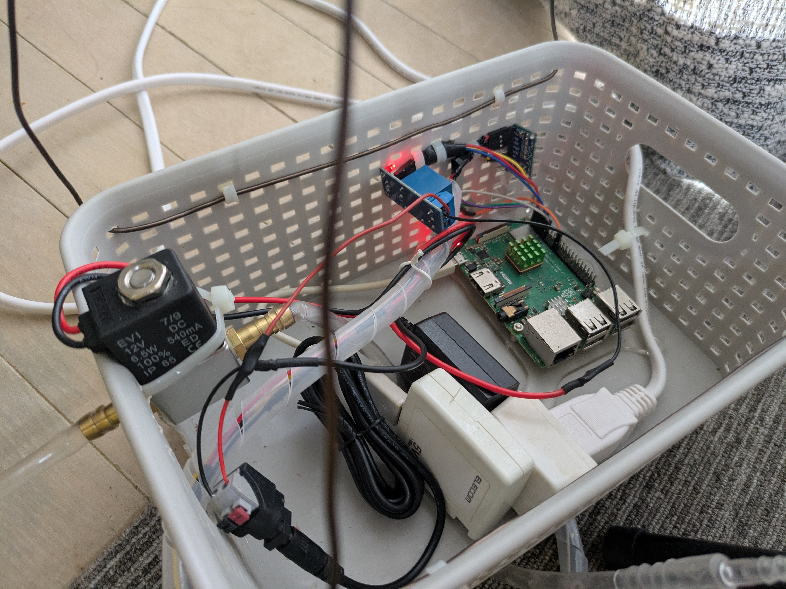
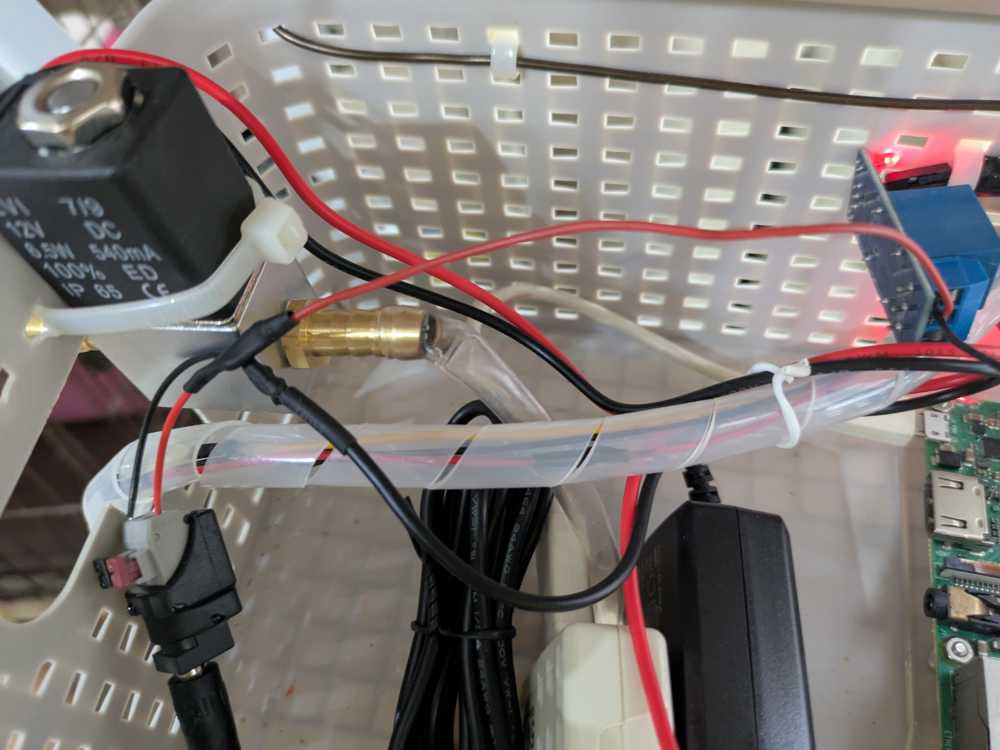
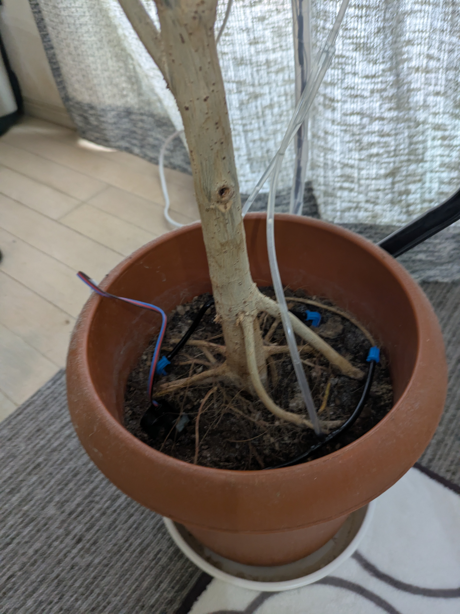
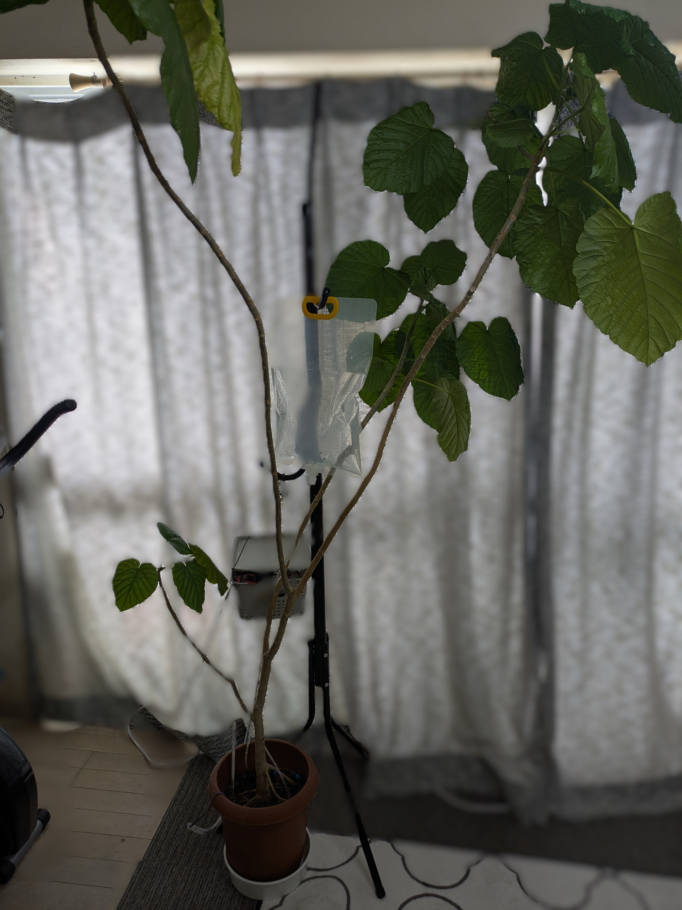

# WaterDispensorForHousePlants

## 概要

- Raspiを使って観葉植物に水やりを行うシステム

## 機能

1. 土壌水分検知
    -センサの感度がよくないために現状では実用には耐え難い印象(検証中)
1. 電磁弁の開閉
1. 上記の定期実行(cron)

## 利用技術

|ID|技術名|説明|備考|
|:--|:-|:-|:-|
|1|python|-||
|2|time|時間を扱うための標準ライブラリ|-|
|3|numpy|数値計算ライブラリ|[numpy公式](https://numpy.org/ja/)※代替としてmathで問題なし|
|4|Adafruit_ADS1x15|A/Dコンバータの制御ライブラリ(Adafuruit純正) ※土壌水分センサの値をRaspiで取得するために必要|[公式](https://github.com/adafruit/Adafruit_CircuitPython_ADS1x15) ※購入した製品により適宜変更必要|
|5|GPIO|RaspiのGPIOを扱うドライバ|-|

## 補足

1. 詳細は後述の元ネタやリンク集を読んでいただければわかるかと思います

### 元ネタ

1. [RaspberryPiZeroWで植物への自動水やりシステム作った](https://linuxfun.org/2021/06/25/raspberry-pi-watering-system/)
    - 今回の制作物では一部配線廻りは変更しています
        - 配線の変更内容は後日記載予定

### 改良点

1. 水の供給方式をポンプ式から高架式に変更
    - ポンプ自体が流量調整できるものではなかったため
        - 起動・停止を繰り返してもいいが耐久に問題がでそう
        - 流量調整可能なポンプは高価
        - 床に水の入ったものを置くとスペースを結構とってしまう
1. 水の流量調整が難しいために点滴型の潅水キットを導入
    - 植物によって流量の調整が難しそう
    - 水を供給するチューブの設置方法によっては
1. 外部機器の電源をACからとれる様に変更
    - ポンプや電磁弁は直流が多いため `元ネタ` でも電池で行っているがメンテやエラーハンドリングが大変
       - Raspiからも電源はとれる(5v or 3v)が取れるが利用できる製品が限られてしまう
       - 電池切れを検知するために別の機能を組むのは大変
       - 単純に電池の交換が手間
       - コストも高い

## 課題

- [ ] 土壌水分センサの感度(ハードの交換しかない可能性大)
- [ ] AIによる水やりの要不要判定(導入が必要そうな理由は以下)
    - 前述の通り `土壌水分センサーのみ` では水やりの適切なタイミングを検出できない
        - 日々取得した値を確認しているが数値が安定しない(適切な閾値を定められない)
    - 鉢植えの環境？
        - 鉢の土は湿っているのに葉がしおれてきたりと植物全体を観察しないと適切なタイミングが見極め難い
- [ ] 季節による水やり量の変化
    - はたしてAIと土壌水分センサでの判定が可能もしくは精度があがったとしても植物にとって適切なタイミングといえるのかが不明
        - 農業の基本的なノウハウが必要？
            - 季節ごとの水やりのタイミングや回数なども加味必要？
- [ ] 点滴型の潅水方式では土の表面が乾いたままとなる
    - 長期に育てて見ないとわからないが植物の成長に影響がありそう？
        - また点滴型でも水やりの仕方を工夫しないと土の内部の湿気がこもり根腐れの原因になり得そう
- [ ] WEB化
    - 現状ではRaspi内でcron

### 購入品

1. [Raspberry Pi Model B+](https://raspberry-pi.ksyic.com/main/index/pdp.id/130,39,2,282,283/pdp.open/2)
    - オーバースペックであるためにコストが安い[Raspberry Pi Zero W](https://raspberry-pi.ksyic.com/main/index/pdp.id/406,407,408,409,410,219,222/pdp.open/219)や[Raspberry Pi Pico W](https://raspberry-pi.ksyic.com/main/index/pdp.id/863/pdp.open/863)でもよさそう(ただしMicroPython等の制約あり)
1. [土壌水分センサ](https://www.amazon.co.jp/Ren-He-%E5%9C%9F%E5%A3%8C%E6%B9%BF%E5%BA%A6%E3%82%BB%E3%83%B3%E3%82%B5%E3%83%BC%E3%83%A2%E3%82%B8%E3%83%A5%E3%83%BC%E3%83%AB-%E8%80%90%E9%A3%9F%E6%80%A7%E3%82%B1%E3%83%BC%E3%83%96%E3%83%AB%E4%BB%98%E3%81%8D-%E3%82%AA%E3%83%BC%E3%83%88%E3%83%9E%E3%83%81%E3%83%83%E3%82%AF%E7%B5%A6%E6%B0%B4%E3%82%B7%E3%82%B9%E3%83%86%E3%83%A0/dp/B09B224QRV/ref=sr_1_5?__mk_ja_JP=%E3%82%AB%E3%82%BF%E3%82%AB%E3%83%8A&crid=1INPNEGTBFQ2X&dib=eyJ2IjoiMSJ9.xM9gFDPvjGRcMrDloKSgBP9BgW8HgVCD_98ZA_fL04PLN-mO_hVUJpZMng_w9pskY7p71poBQabsFWbudtLy4KIaJVRRMxNKmu7R1tw3QuF0v8BNGjZQlWLvYPNW2hsUy7AVbFQOIDQU5zVNjpjhOZPhEFeII-4MuwpRN6W9f7BPJSV0YlTCAJq86UfYGVenMAjuf88NOkj0UKMjMLF6LxWV_hhMJvul1vmgVeWL21_wn443Plz423_HvWpkhpXovyibXNjPGMQAtFgAzNbJyqIqUIK6Bpan045Ab9w3-2k.SgwQogXZDshEl5HBEOav23hQCxykrvJoMM0nHGLXrbI&dib_tag=se&keywords=%E5%9C%9F%E5%A3%8C%E6%B0%B4%E5%88%86%E3%82%BB%E3%83%B3%E3%82%B5%E3%83%BC&qid=1743827047&s=industrial&sprefix=%E5%9C%9F%E5%A3%8C%E6%B0%B4%E5%88%86%E3%82%BB%E3%83%B3%E3%82%B5%E3%83%BC%2Cindustrial%2C169&sr=1-5&xpid=O9MqDRDOU-nrp)
    - 土壌の水分を計測するセンサ
        - 実際は精度の問題から現在別のセンサ2点を購入し検証中
1. [A/Dコンバータ](https://www.amazon.co.jp/KKHMF-ADS1115-4%E3%83%81%E3%83%A3%E3%83%B3%E3%83%8D%E3%83%AB-%E3%82%B2%E3%82%A4%E3%83%B3%E3%82%A2%E3%83%B3%E3%83%97-Arduino/dp/B07J4R941L)
    - 土壌水分センサのアナログ値をデジタル値へ変換するコンバータ
1. [リレーモジュール](https://www.amazon.co.jp/GOODCHI-%E3%83%AA%E3%83%AC%E3%83%BC%E3%83%A2%E3%82%B8%E3%83%A5%E3%83%BC%E3%83%AB-%E7%B6%99%E9%9B%BB%E5%99%A8%E3%83%A2%E3%82%B8%E3%83%A5%E3%83%BC%E3%83%AB%E9%96%8B%E7%99%BA%E3%83%9C%E3%83%BC%E3%83%89-1%E3%83%81%E3%83%A3%E3%83%B3%E3%83%8D%E3%83%AB-%E3%83%95%E3%82%A9%E3%83%88%E3%82%AB%E3%83%97%E3%83%A9%E4%BB%98%E3%81%8D/dp/B0BZTSXJLB/ref=pd_sbs_d_sccl_4_4/355-2338038-6561555?pd_rd_w=G5snH&content-id=amzn1.sym.13eb81e1-7d13-4eb9-803d-fea9198bc9c1&pf_rd_p=13eb81e1-7d13-4eb9-803d-fea9198bc9c1&pf_rd_r=R7YVZ0B09PM295V12R3X&pd_rd_wg=g1R8q&pd_rd_r=6c11d674-4de1-4bef-ba1e-3b1a1b272f50&pd_rd_i=B0BZTSXJLB&psc=1)
    - 電気信号により回路をON/OFFにするモジュール
        - 電磁弁のON/OFF(電気の供給)をRaspiのGPIOから制御するために利用
        - 実際は `元ネタ` で購入したキットのものを利用(リンクは同等品)
1. [電磁弁(ソレノイドバルブ)](https://www.amazon.co.jp/dp/B07R12PTZB?ref=ppx_yo2ov_dt_b_fed_asin_title)
    - 電磁弁は安価なものも存在したが耐圧が低く(本品は1.2Mpa)水漏れがおこったために本品を採用
1. [ホースジョイント](https://www.amazon.co.jp/dp/B0C4KVLYS8?ref=ppx_yo2ov_dt_b_fed_asin_title&th=1)
    - 電磁弁とチューブを接続させるための継ぎ手
1. [異径コネクター](https://www.amazon.co.jp/dp/B09SHQW3ZJ?ref=ppx_yo2ov_dt_b_fed_asin_title)
    - 給水バッグのキャップ(チューブが差し込める様になっている)とバルブのホースジョイントの口径の差を埋めるための異径継ぎ手
1. [給水バッグ](https://www.amazon.co.jp/dp/B0D6G5KDZQ?ref=ppx_yo2ov_dt_b_fed_asin_title)
    - 水をいれて吊り下げておくビニル製の袋
    - リンク先のものはドリッパーが付属しているが鉢の面積に対してドリッパー2本では少なかったためにドリッパーは追加購入している
1. [点滴潅水用のチューブとドリッパー](https://www.amazon.co.jp/NFESOLAR-%E8%87%AA%E5%8B%95%E6%95%A3%E6%B0%B4%E3%82%BF%E3%82%A4%E3%83%9E%E3%83%BC-%E7%B5%A6%E6%B0%B4%E3%82%B7%E3%82%B9%E3%83%86%E3%83%A0%E3%82%BF%E3%82%A4%E3%83%9E%E3%83%BC%E8%A3%85%E7%BD%AE-%E3%83%89%E3%83%AA%E3%83%83%E3%83%97%E6%95%A3%E6%B0%B4%E3%82%B7%E3%82%B9%E3%83%86%E3%83%A0%E7%9B%86%E6%A0%BD-%E6%97%A5%E6%9C%AC%E8%AA%9E%E5%8F%96%E6%89%B1%E8%AA%AC%E6%98%8E%E6%9B%B8%E4%BB%98%E3%81%8D/dp/B0C3C4J64H?ref_=ast_sto_dp&th=1)
    - 購入した製品が品切れであったために同等の商品を掲載(購入したものはソーラーパネルがなく安価)
    - ドリッパー・チューブ・コネクタはセットではなく個別でも販売されている
1. [ACアダプタ](https://www.amazon.co.jp/dp/B0D6RFQW6B?ref=ppx_yo2ov_dt_b_fed_asin_title&th=1)
    - 電磁弁の電源用
1. [ポールハンガー](https://www.amazon.co.jp/%E6%AD%A6%E7%94%B0%E3%82%B3%E3%83%BC%E3%83%9D%E3%83%AC%E3%83%BC%E3%82%B7%E3%83%A7%E3%83%B3-%E3%80%90%E3%82%B3%E3%83%BC%E3%83%88%E3%83%BB%E3%83%90%E3%83%83%E3%82%B0%E3%83%BB%E7%8E%84%E9%96%A2%E3%83%BB%E3%83%AA%E3%83%93%E3%83%B3%E3%82%B0%E3%80%91-39%C3%9737%C3%97170cm-%E3%82%B9%E3%83%81%E3%83%BC%E3%83%AB%E3%83%9D%E3%83%BC%E3%83%AB%E3%83%8F%E3%83%B3%E3%82%AC%E3%83%BC-SPH170/dp/B0DV5BMYVQ/ref=sr_1_12?__mk_ja_JP=%E3%82%AB%E3%82%BF%E3%82%AB%E3%83%8A&crid=1A1EZQ3GXYSOA&dib=eyJ2IjoiMSJ9.Ny6GXj7ybsQnPrwrNH_W5hoKWTKMJiCCY6AYO6JMRNM6Dnate1NPT6r37uiIxZZlw5jqLpe_c5u05wFUJYq3tFpKJ2pezqzTQQk8oMLKPHjoU2gQfRjvLEOgYz6EqygpBjiXFI6CRr3GcfPdtjuG1J9oY5nzuaIdJfHGjg8gGCni9Jg9SaddPmVUCoJbFTTGib0TCAMXAO2pcC-fa-8Cn4gO3aj9T4HlaEAR0e1EljonmhRST5oEXIAKbtFSe-lf33zHhETx36m7zCW7bS5CSipsh9vUWFZ6cv9T4Q_w7h0.PtTaDoMQo9dIdBiB5j2foWhXD1nz0yPPvktSW06MjzQ&dib_tag=se&keywords=%E3%83%9D%E3%83%BC%E3%83%AB%E3%83%8F%E3%83%B3%E3%82%AC%E3%83%BC&qid=1743828567&sprefix=%E3%83%9D%E3%83%BC%E3%83%AB%E3%83%8F%E3%83%B3%E3%82%AC%E3%83%BC%2Caps%2C185&sr=8-12&th=1)
    - 給水バッグを吊り下げるために使用
        - ダイソーで770円でうっていましたがネットのダイソーでは現在確認できなかったために同等品を掲載

#### その他購入品

- リンクを貼るほどでもなく一般的に100均などで購入できるものを列挙
1. Raspiなどをいれるケース(100均で購入)
1. 延長コード(3m)
1. 針金(Raspiをいれた1.のケースをハンガーラックに吊るすために使用)
1. 結束バンド
1. 配線(+/-)だけのもの(ホームセンターの自動車コーナーなどで販売されている)
   - 配線接続はむき身の配線同士をよじりビニルテープで止めたがカプラーなどを購入すればメンテ性はあがる(販売場所は同じ)
1. ビニルテープ
1. 半田ごてとはんだ
1. USB-Bケーブル(Raspiの電源用)

### リンク集
1. [GPIOの説明](https://deviceplus.jp/raspberrypi/raspberrypi-gpio/)
1. [A/Dコンバータの説明](https://tech-and-investment.com/raspberrypi2-5-ads1015/)
1. [リレーモジュールの説明](https://araisun.com/raspi-relay.html)

### 完成品の画像

開いて閲覧

1. Raspiと制御関係の全体

1. A/Dコンバータとリレースイッチ

1. 電磁弁付近

1. 土壌センサとドリッパー

1. 給水バッグと全体

1. 全体

<detail>
